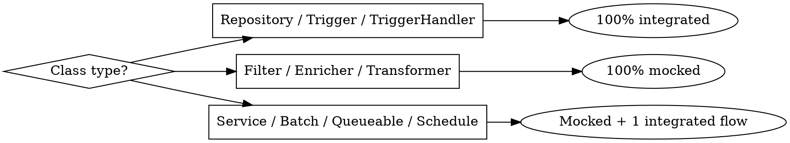

# Salesforce Apex Testing

## Overview

Salesforce requires **75% test coverage** before any Apex code can be deployed to production. Tests must be deterministic — same input, same output, every time. The three pillars of this skill:

1. **FixtureFactory** — reusable test data factories
2. **Mocks** — test doubles that remove DB/network dependency
3. **When to use each** — decision guide per class type

---

## Rules Every Test Class Must Follow

1. The test class must be declared `public`
2. Test method names must follow `should` or `givenWhenThen` naming conventions
3. Use the `Assert` class for all assertions — never `System.assert` / `System.assertEquals`
4. Prefer mocks over database persistence — keep tests fast and isolated
5. Always use a `FixtureFactory` class to supply test data — never create `SObject` instances inline in test methods
6. Each `FixtureFactory` must be segregated by SObject — never create a single factory for the entire org

---

## FixtureFactory Pattern

A `FixtureFactory` is an `@isTest` class that centralizes test data creation. Every test class that needs a `Contract`, `Order`, or custom object gets it from the factory — never from ad-hoc inline `new SObject()` chains.

### Key Rules

| Method prefix | Behavior |
|---|---|
| `newXxx()` | Returns an in-memory record with **no Id** — use for insert flows |
| `newWithFakeId()` | Returns an in-memory record with a **fake Id** — use for update/mock flows |
| `create()` / `createXxx()` | **Inserts** the record to the DB and returns it — use only in integrated tests |
| `fromJson()` | Deserializes a single record from a JSON string — use when a real Salesforce Id is required inside a mock |
| `fromJsonArray()` | Deserializes a list of records from a JSON array string |

Additional rules:
- Always annotate with `@isTest` — factory classes must never ship to production
- All methods must be `static` — no instance required to call them
- Respect required field constraints when providing test data

### Minimal Structure

```java
@isTest
public class OrderFixtureFactory {

    // In-memory instance — use for insert flows
    public static Order newOrder(Account account) {
        return new Order(
            Name          = 'Test Order',
            Status        = 'Draft',
            EffectiveDate = Date.today(),
            AccountId     = account.Id
        );
    }

    // In-memory instance with a fake Id — use for update/mock flows
    public static Order newWithFakeId(Account account) {
        Order o = newOrder(account);
        IdGenerator.generate(o); // sets o.Id = valid fake 18-char Id
        return o;
    }

    // Inserts and returns the record — use only in integrated tests
    public static Order create(Account account) {
        return create(newOrder(account));
    }

    public static Order create(Order order) {
        insert order;
        return order;
    }

    // Deserializes a captured Org payload — use when a real Id is required inside a mock
    public static Order fromJson(String payload) {
        return (Order) JSON.deserialize(payload, Order.class);
    }

    public static List<Order> fromJsonArray(String payload) {
        return (List<Order>) JSON.deserialize(payload, List<Order>.class);
    }
}
```

### AccountFixtureFactory — Full Example

The `create()` method is overloaded — one variant accepts individual fields and delegates to `newAccount()`, the other accepts an already-built record. Both insert and return the record.

```java
@isTest
public class AccountFixtureFactory {

    public static Account create(String name, String documentNumber) {
        return create(newAccount(name, documentNumber));
    }

    public static Account create(Account account) {
        insert account;
        return account;
    }

    public static Account newAccount(String name, String documentNumber) {
        return new Account(
            Name              = name,
            DocumentNumber__c = documentNumber,
            BillingStreet     = 'Test Street',
            BillingCity       = 'Test City',
            BillingState      = 'SP'
        );
    }

    public static Account fromJson(String payload) {
        return (Account) JSON.deserialize(payload, Account.class);
    }

    public static List<Account> fromJsonArray(String payload) {
        return (List<Account>) JSON.deserialize(payload, List<Account>.class);
    }
}
```

### Test Examples Using FixtureFactory

**Integrated test — verifying trigger side effects:**

```java
@isTest
static void shouldCreateAccountWithValidDocumentAndCreateTask() {

    // given
    Account account = AccountFixtureFactory.create('Test Account', '111.444.777-35');

    // then
    Assert.isTrue(account.Id != null);

    List<Task> tasks = [SELECT Id FROM Task WHERE WhatId = :account.Id];

    Assert.isFalse(tasks.isEmpty());
    Assert.areEqual(1, tasks.size(), 'Only one task should be created');
}
```

**Integrated test — verifying validation error on update:**

```java
@isTest
static void shouldRejectAccountUpdateWithInvalidDocument() {

    // given
    Account account = AccountFixtureFactory.create('Test Account', '111.444.777-35');
    account.DocumentNumber__c = '111.444.777-95'; // invalid

    try {
        // when
        update account;

        Assert.fail('Should not update account with invalid document number');

    } catch (DmlException e) {
        Assert.isTrue(true); // expected failure confirmed
        Assert.isTrue(e.getDmlMessage(0).contains('Invalid document number'));
    }
}
```

### Capturing a Real Id for Mocks

When a mock must return a record that references a real Salesforce `Id` (e.g., `Account.Id`), run an anonymous script in the Org:

```java
System.debug(JSON.serialize([SELECT Id FROM Order LIMIT 1]));
// Output: {"Id":"8018c000001hsePAAQ"}
```

Store that JSON in a `String payload` constant inside the factory or pass it to the Mock constructor.

---

## Chaining FixtureFactories for Complex Scenarios

For complex object hierarchies (e.g., a `Contract` that requires `Account`, `Product2`, `PriceBook2`, `Opportunity`, and `OpportunityLineItem`), use the `createIntegratedScenario()` pattern:

1. Determine the object dependency tree
2. Establish the creation sequence (leaf nodes first)
3. Store all created records in a `Map<String, SObject>` and return it from each factory
4. Chain factories — each one calls the previous and extends the shared map

**Creation sequence for this example:**
1. `Product2`
2. `PriceBook2` (via `Test.getStandardPriceBookId()`)
3. `PriceBookEntry` (requires `PriceBook2` + `Product2`)
4. `Account`
5. `Opportunity` (requires `Account` + `PriceBook2`)
6. `OpportunityLineItem` (requires `Opportunity` + `Product2`)
7. `Contract`

### ProductFixtureFactory

```java
@isTest
public class ProductFixtureFactory {

    public static Product2 create(String productName) {
        return create(newProduct(productName));
    }

    public static Product2 create(Product2 product) {
        insert product;
        return product;
    }

    public static Product2 newProduct(String productName) {
        return new Product2(
            Name   = productName,
            Family = 'Test'
        );
    }

    public static Product2 fromJson(String payload) {
        return (Product2) JSON.deserialize(payload, Product2.class);
    }

    public static List<Product2> fromJsonArray(String payload) {
        return (List<Product2>) JSON.deserialize(payload, List<Product2>.class);
    }
}
```

### PriceBookFixtureFactory

```java
@isTest
public class PriceBookFixtureFactory {

    public static PriceBook2 getStandardPricebook() {
        return new PriceBook2(
            Id       = Test.getStandardPriceBookId(),
            IsActive = true
        );
    }
}
```

### PriceBookEntryFixtureFactory

This is the first factory to define `createIntegratedScenario()`. It returns a shared `Map<String, SObject>` that downstream factories extend rather than re-creating records.

```java
@isTest
public class PriceBookEntryFixtureFactory {

    public static PriceBookEntry create(PriceBook2 priceBook, Product2 product) {
        return create(newPricebookEntry(priceBook, product));
    }

    public static PriceBookEntry create(PriceBookEntry priceBookEntry) {
        insert priceBookEntry;
        return priceBookEntry;
    }

    public static PriceBookEntry newPricebookEntry(PriceBook2 priceBook, Product2 product) {
        return new PriceBookEntry(
            PriceBook2Id = priceBook.Id,
            Product2Id   = product.Id,
            UnitPrice    = 1.0,
            IsActive     = true
        );
    }

    public static PriceBookEntry fromJson(String payload) {
        return (PriceBookEntry) JSON.deserialize(payload, PriceBookEntry.class);
    }

    public static List<PriceBookEntry> fromJsonArray(String payload) {
        return (List<PriceBookEntry>) JSON.deserialize(payload, List<PriceBookEntry>.class);
    }

    public static Map<String, SObject> createIntegratedScenario() {
        Map<String, SObject> records = new Map<String, SObject>();

        Product2 product = ProductFixtureFactory.create('Test Product');
        records.put('product', product);

        PriceBook2 priceBook = PriceBookFixtureFactory.getStandardPricebook();
        records.put('priceBook', priceBook);

        PriceBookEntry priceBookEntry = create(priceBook, product);
        records.put('priceBookEntry', priceBookEntry);

        return records;
    }
}
```

### OpportunityFixtureFactory

Calls `PriceBookEntryFixtureFactory.createIntegratedScenario()` and adds `Account`, `Opportunity`, and `OpportunityLineItem` to the same map — no duplicate inserts, no extra SELECTs.

```java
@isTest
public class OpportunityFixtureFactory {

    public static Opportunity newOpportunity(Account account, PriceBook2 priceBook) {
        return new Opportunity(
            AccountId    = account.Id,
            Name         = 'Test Opportunity',
            PriceBook2Id = priceBook.Id,
            CloseDate    = Date.today().addDays(1),
            StageName    = 'Prospecting'
        );
    }

    public static Opportunity create(Account account, PriceBook2 priceBook) {
        return create(newOpportunity(account, priceBook));
    }

    public static Opportunity create(Opportunity opportunity) {
        insert opportunity;
        return opportunity;
    }

    public static Opportunity fromJson(String payload) {
        return (Opportunity) JSON.deserialize(payload, Opportunity.class);
    }

    public static List<Opportunity> fromJsonArray(String payload) {
        return (List<Opportunity>) JSON.deserialize(payload, List<Opportunity>.class);
    }

    // Chains from PriceBookEntryFixtureFactory — reuses its records map
    public static Map<String, SObject> createIntegratedScenario() {
        Map<String, SObject> records = PricebookEntryFixtureFactory.createIntegratedScenario();

        Account account = AccountFixtureFactory.create('Test Account', '111.444.777-35');
        records.put('account', account);

        PriceBook2 priceBook   = (PriceBook2) records.get('priceBook');
        Opportunity opportunity = create(account, priceBook);
        records.put('opportunity', opportunity);

        Product2 product                      = (Product2) records.get('product');
        OpportunityLineItem opportunityLineItem = OpportunityLineItemFixtureFactory.create(opportunity, product);
        records.put('opportunityLineItem', opportunityLineItem);

        return records;
    }
}
```

**Consuming the chain in a test:**

```java
@isTest
static void shouldCreateContractFromOpportunity() {

    // given — all records created in dependency order, shared via map
    Map<String, SObject> records = OpportunityFixtureFactory.createIntegratedScenario();

    Opportunity opportunity = (Opportunity) records.get('opportunity');
    Account account = (Account) records.get('account');

    // when
    Contract contract = ContractFixtureFactory.create(account, opportunity);

    // then
    Assert.isNotNull(contract.Id);
}
```

> Never create a single `FixtureFactory` class for the entire org. Always segregate by SObject — the long-term payoff is the ability to produce tests far more quickly by reusing individual factories across the entire test suite.

---

## Mock Patterns (Test Doubles)

### The Four Variations

| Type | What it does |
|------|-------------|
| **Fake** | Overrides methods with stub implementations (no DB) |
| **Stub** | Returns predefined data; avoids real execution side-effects |
| **Spy** | Stub that also records calls (e.g., how many times `save` was called) |
| **Mock** | Combines all three + verifies interactions — use the _Mocker_ framework |

### Creating a Fake with Inheritance

The pattern is `class XxxMock extends Xxx` — it **is** the real class, so it can be injected anywhere the real class is accepted.

```java
@isTest
public class OrderRepositoryMock extends OrderRepository {

    public OrderRepositoryMock() {}

    override
    public SObject save(SObject record, Schema.SObjectField field) {
        return IdGenerator.generate(record); // fake Id, no DML
    }
}
```

> **Required on production classes:** add `virtual` to any class or method that will be extended. Without it, `override` will not compile.

### Injecting the Mock (Dependency Injection via Setter)

```java
// Production class
public class OrderInboundService {
    OrderRepository orderRepository;

    public OrderInboundService() {
        this.orderRepository = new OrderRepository();
    }

    // Setter used only in tests to inject a mock
    public void setOrderRepository(OrderRepository repo) {
        this.orderRepository = repo;
    }
}

// Test class
@isTest
static void givenOrderWhenSaveThenReturnId() {
    OrderInboundService service = new OrderInboundService();
    service.setOrderRepository(new OrderRepositoryMock()); // inject

    Test.startTest();
    PurchaseOrderInboundResponse response = service.save(request);
    Test.stopTest();

    Assert.isNotNull(response.id);
}
```

### Simulating Errors

```java
@isTest
public class OrderRepositoryDmlExceptionMock extends OrderRepository {

    override
    public SObject save(SObject record, Schema.SObjectField field) {
        if (true) { // tricks the compiler — unreachable return is required
            throw new DmlException('Invalid Account');
        }
        return null;
    }
}
```

### Mocking Static-Method Classes (@RestResource, @AuraEnabled, @InvocableMethod)

Static methods cannot be overridden. The workaround: declare dependencies as **static variables** initialized in a static block, so tests can swap them out.

```java
@RestResource(urlMapping='/api/orders/*')
global class OrderController {

    public static OrderInboundService orderInboundService;

    static {
        orderInboundService = new OrderInboundService();
    }

    @HttpPost
    global static void create(PurchaseOrderInboundRequest purchaseOrder) {
        // uses orderInboundService...
    }
}

// In the test class, swap before calling:
OrderController.orderInboundService = mockedService;
OrderController.create(purchaseOrder);
```

### Using Test.isRunningTest() is a Bad Practice

Never mix test conditionals into production code. Use a Mock override instead:

```java
// BAD — mixes test logic into production
if (Test.isRunningTest()) return;
System.enqueueJob(new ChainQueueable(logs));

// GOOD — extract to a virtual method and override in mock
virtual
protected void enqueueNextJob(List<Log__c> logs) {
    System.enqueueJob(new ChainQueueable(logs));
}

// Mock simply overrides to do nothing:
override
public void enqueueNextJob(List<Log__c> logs) { }
```

---

## When to Use Integrated vs Mocked Tests



### Decision Table

| Class Type | Strategy | Reason |
|-----------|----------|--------|
| **Repository** | 100% integrated | Only purpose is DB access; catches validation rules, Flows, Process Builders |
| **Trigger / TriggerHandler** | 100% integrated | Responds to DB events — the DB is the input |
| **Filter** | 100% mocked | Receives lists, returns lists — no DB needed |
| **Enricher** | 100% mocked | If Trigger already tests the DB path, Enricher tests only the logic |
| **Transformer** | 100% mocked | Assert **every transformation line** — this is where integration bugs hide |
| **OutboundService** | Mocked + consider 1 integrated | Callouts use `Test.setMock`; add integrated test if DML + Flows exist |
| **InboundService (@RestResource)** | Mostly mocked | Add integrated test if parameterized flows affect behavior |
| **Future / Queueable / Schedulable** | Mostly mocked | Simulate chaining with Fake override; avoid `Test.isRunningTest()` |
| **Batch** | Mocked `execute` + consider 1 integrated | Test each method in isolation; integrated test validates bulkification |

### The Non-Negotiable Rule

> **In mocked tests, REAL DML must never happen.** Always mock the `save` methods of every Repository the class under test depends on. Forgetting one causes `CROSS REFERENCE ID` errors when deploying to a new Org.

---

## Common Mistakes

| Mistake | Fix |
|---------|-----|
| Using `Test.isRunningTest()` in production code | Extract to a `virtual` method and override in a Mock |
| Creating `new SObject()` inline in every test | Extract to a FixtureFactory |
| Hardcoding real Salesforce Ids in tests | Use `IdGenerator.generate()` or `fromJson(payload)` with a captured Id |
| Forgetting `virtual` on production class/method | Add `virtual` — required for inheritance |
| DML inside a mocked test | Mock all Repository `save` methods |
| Testing only the happy path | Always test the error path with a `DmlExceptionMock` or `thenThrow()` |
| Querying existing Org data in tests | Tests must create their own data — Org state is not guaranteed |
| Using `System.assertEquals` | Use `Assert.areEqual` — preferred since API v56+ |
| One FixtureFactory for all objects | Segregate by SObject — one factory per object |

---

## Quick Reference: Test Assertions

```java
// Modern Assert class — API v56+, preferred
Assert.isTrue(condition, 'message');
Assert.isFalse(condition, 'message');
Assert.areEqual(expected, actual, 'message');
Assert.isNotNull(value, 'message');
Assert.isNull(value, 'message');
Assert.fail('should not reach here');

// Classic (System class) — still valid but less readable
System.assert(condition, 'message');
System.assertEquals(expected, actual, 'message');
System.assertNotEquals(notExpected, actual, 'message');
```

## Quick Reference: Visibility Annotations

```java
@TestVisible   // makes private/protected members visible to @isTest classes
@isTest        // marks a class or method as test-only; excluded from 75% coverage count
```
